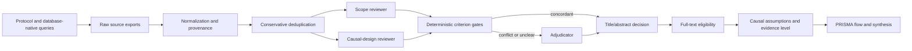

# Causal Multi-omics Review

Reproducible PRISMA-oriented pipeline for a scoping review of biological and
health studies that integrate multiple omics layers and make causal claims.

This repository reuses the methodological architecture of
[`BogdanDidenko/text-bio-fundational-models-review`](https://github.com/BogdanDidenko/text-bio-fundational-models-review):
database-native searches, conservative deduplication, criterion-level LLM
screening, deterministic gates, conflict adjudication, repeated-run checks,
and a complete audit trail. The review question, eligibility rules, search
queries, schemas, and prompts are new and specific to causal multi-omics.

## Review Question

Which empirical multi-omics studies support a biological causal claim, and
what provides identification: a randomized or non-randomized intervention,
direct perturbation, genetic instrument, temporal design, formal mediation,
or a graphical/directed model?

The retrieval strategy does not require the exact phrases `causal inference`
or `causal discovery`. It searches for design-specific causal anchors.

## Pipeline



An LLM never emits the final inclusion decision directly. Reviewers return
criterion-level JSON; Python applies versioned rules. Unclear evidence is
retained for adjudication or full-text review.

## Repository Layout

- `protocol/`: review question, eligibility criteria, PRISMA process, exact
  database queries, agent prompts, schemas, and gate configuration.
- `src/causal_multiomics_review/`: reusable normalization, deduplication,
  screening gates, and audit utilities.
- `scripts/`: command-line entry points for validation, deduplication,
  screening, and replicate comparison.
- `tests/`: regression tests for deterministic pipeline behavior.
- `data/`: local pipeline stages; generated study data are ignored by Git.
- `runs/`: immutable run manifests and summaries; large/raw outputs are
  ignored unless deliberately curated.
- `docs/reference-repo-audit.md`: detailed reuse analysis of the source repo.

## Quick Start

```bash
python -m venv .venv
source .venv/bin/activate
python -m pip install -e '.[dev]'
python scripts/validate_protocol.py
pytest
```

Deduplicate a normalized CSV:

```bash
python scripts/deduplicate.py input.csv data/normalized/canonical.csv \
  --log data/normalized/deduplication_log.csv
```

Run criterion-level screening with an OpenAI-compatible endpoint:

```bash
export SCREENING_API_KEY=...
python scripts/run_screening.py data/normalized/canonical.csv runs/pilot-001 \
  --model YOUR_MODEL --base-url https://api.example.com/v1
```

API keys are read only from environment variables. The local helper
`academic-api-env` can load the academic database credentials already stored
in macOS Keychain; no key belongs in this repository.

Probe current database counts without committing credentials:

```bash
eval "$(academic-api-env)"
python scripts/probe_searches.py runs/search-calibration
```

## Current Status

The protocol, calibrated query pack, first task-specific screening prompts,
config-driven gates, audit utilities, tests, and CI are initialized. Search
counts from 2026-07-18 are calibration evidence, not final PRISMA counts; a
new frozen retrieval run must be created before formal screening begins.

## License

MIT. See `LICENSE`.
